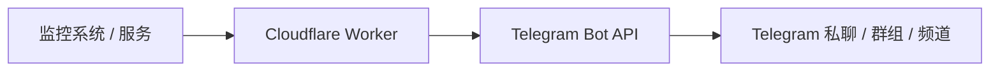

# Cloudflare Telegram 通知网关

[English](README.md) | [简体中文](README.zh-CN.md)

一个小巧、无状态且安全的通知转发服务，通过 Cloudflare Workers 将 HTTP 通知发送到 Telegram。

> 消息内容由上游决定，网关只负责安全投递。

## 为什么需要它

许多监控工具和小型服务只需要把通知可靠地发送到一个 Telegram 目标。为此运行完整的机器人框架、数据库、管理面板、容器或 VPS，会带来不必要的维护成本和攻击面。

本项目只做一件事：接收经过认证的 HTTP 请求，并使用保存在 Worker Secret 中的 Bot Token 和目标 Chat ID 调用 Telegram `sendMessage` API。

## 功能特点

- 完全基于 Cloudflare Workers，无状态运行
- 不需要数据库、KV、D1、Durable Objects、队列、定时任务、Docker 或前端
- 零运行时 npm 依赖
- Bearer Token 认证，并使用恒定时间比较
- 纯文本原样转发，不自动添加格式
- JSON 模式只接受少量安全的展示参数
- Telegram 目标只能通过 Worker Secret 配置
- 可选 Telegram 论坛话题支持
- 64 KiB 请求上限和 4,096 字符消息上限
- 统一、安全的 JSON 错误响应和请求 ID
- 所有 Telegram 网络请求在测试中均被模拟

## 架构



Worker 只提供 `GET /health` 和 `POST /v1/notify`。它不保存状态、不接收 Telegram 更新，也不允许调用方选择 Bot 或发送目标。

## 快速开始

需要 Node.js 20 或更高版本、npm 和 Cloudflare 账户。

```powershell
npm install
Copy-Item .dev.vars.example .dev.vars
npm test
npx wrangler dev
```

请仅在本地 `.dev.vars` 中填写测试配置。该文件已被 Git 忽略，不应提交。

## 部署到 Cloudflare

登录并部署 Worker：

```powershell
npx wrangler login
npx wrangler deploy
```

随后配置三个必需的生产 Secret：

```powershell
npx wrangler secret put TELEGRAM_BOT_TOKEN
npx wrangler secret put TELEGRAM_CHAT_ID
npx wrangler secret put GATEWAY_SECRET
```

仅在使用 Telegram 论坛话题时配置：

```powershell
npx wrangler secret put TELEGRAM_MESSAGE_THREAD_ID
```

首次部署可以在配置 Secret 前完成，但在必需配置缺失时，通知接口只会返回安全的配置错误。项目没有硬编码 Cloudflare Account ID。

## Telegram 设置

1. 使用 Telegram 官方 [@BotFather](https://t.me/BotFather) 创建 Bot。
2. 将 Bot Token 保存为 `TELEGRAM_BOT_TOKEN` Worker Secret。
3. 把 Bot 加入目标私聊、群组、超级群组或频道。
4. 将目标 ID 保存为 `TELEGRAM_CHAT_ID`。

本项目只负责发送消息，不接收 Telegram Webhook、不轮询更新，也不处理命令。

## 环境变量

| 名称 | 是否必需 | 用途 |
| --- | --- | --- |
| `TELEGRAM_BOT_TOKEN` | 是 | BotFather 签发的 Bot API Token |
| `TELEGRAM_CHAT_ID` | 是 | 唯一的私聊、群组或频道目标 |
| `GATEWAY_SECRET` | 是 | 与可信上游共享的长随机 Bearer Token |
| `TELEGRAM_MESSAGE_THREAD_ID` | 否 | Telegram 论坛话题数字 ID |

不要提交 `.dev.vars`、真实 Token、真实私有 Chat ID 或生产 Secret。

## 发送通知

所有 `POST /v1/notify` 请求都必须包含：

```text
Authorization: Bearer YOUR_GATEWAY_SECRET
```

网关只从该请求头读取密钥，不接受 URL、查询参数或正文中的密钥。可选的 `X-Notify-Source` 请求头只用于结构化日志，不会添加到 Telegram 消息中。

### 纯文本模式

当 `Content-Type` 为 `text/plain` 时，整个请求正文会直接成为 Telegram 的 `text` 字段。换行、Emoji、下划线和星号都会保留，而且不会设置解析模式。

```text
🔴 网站不可用
example.com
HTTP 500
```

### JSON 模式

```json
{
  "text": "<b>网站不可用</b>\nexample.com",
  "parse_mode": "HTML",
  "disable_notification": false,
  "protect_content": true
}
```

`text` 为必填字段。可选字段只有：

- `parse_mode`：仅接受 `HTML` 或 `MarkdownV2`
- `disable_notification`
- `protect_content`

未知字段以及 `chat_id`、`bot_token`、`token` 等目标覆盖字段会被拒绝。网关不是通用 Telegram API 代理。

默认情况下，网关不会格式化消息。上游发送什么文本，Telegram 就收到什么文本。

### curl 示例

纯文本：

```sh
curl -X POST \
  https://YOUR-WORKER.workers.dev/v1/notify \
  -H "Authorization: Bearer YOUR_GATEWAY_SECRET" \
  -H "Content-Type: text/plain" \
  --data-binary $'🔴 网站不可用\nexample.com\nHTTP 500'
```

JSON：

```sh
curl -X POST \
  https://YOUR-WORKER.workers.dev/v1/notify \
  -H "Authorization: Bearer YOUR_GATEWAY_SECRET" \
  -H "Content-Type: application/json" \
  --data-binary '{"text":"<b>网站不可用</b>\nexample.com","parse_mode":"HTML"}'
```

成功响应：

```json
{
  "ok": true,
  "message_id": 123
}
```

## Telegram 频道设置

要向频道发送消息：

1. 将 Bot 添加为频道管理员。
2. 授予 Bot 发布消息权限。
3. 将频道 Chat ID 配置为 `TELEGRAM_CHAT_ID`。
4. 私有频道 ID 通常以 `-100` 开头。

普通频道不需要 Topic ID。

## 论坛话题支持

只有在向特定 Telegram 论坛话题发送消息时，才设置 `TELEGRAM_MESSAGE_THREAD_ID`。它必须是正整数。普通私聊、非论坛群组和普通频道应保持未设置状态。

## 安全模型

- `/health` 无需认证，但不会泄露任何配置。
- `/v1/notify` 必须提供正确的 Bearer 凭据。
- 认证使用 SHA-256 摘要和恒定时间比较。
- Bot Token 和目标 ID 只从 Worker Secret 读取。
- JSON 字段采用白名单，不提供通用 Telegram 代理能力。
- 日志不包含消息正文、Bot Token、网关密钥、Chat ID 或完整认证请求头。
- Telegram 返回的原始错误描述不会暴露给调用方。
- 默认不返回宽松 CORS 头；这是一个服务器到服务器的 API。

如怀疑凭据泄露，请立即轮换网关密钥和 Bot Token。漏洞报告方式见 [SECURITY.zh-CN.md](SECURITY.zh-CN.md)。

## 错误响应

所有错误使用统一格式：

```json
{
  "ok": false,
  "error": "machine_readable_code",
  "message": "Human-readable description."
}
```

| HTTP | 常见错误码 | 含义 |
| --- | --- | --- |
| 400 | `invalid_json`、`missing_text`、`invalid_parse_mode`、`message_too_long` | 请求内容不合法 |
| 401 | `unauthorized` | Bearer Token 缺失、格式错误或不正确 |
| 404 | `not_found` | 路径不存在 |
| 405 | `method_not_allowed` | 请求方法不允许 |
| 413 | `payload_too_large` | 请求正文超过 64 KiB |
| 415 | `unsupported_content_type` | Content-Type 不受支持 |
| 429 | `rate_limited` | Telegram 限流；存在安全值时会返回 `Retry-After` |
| 500 | `configuration_error` | Worker 配置缺失或无效 |
| 502 | `telegram_error` | Telegram 或网络投递失败 |

每个响应都包含 `X-Request-ID`。

## 日志

Worker 只记录简短的 JSON 事件，包括事件名称、请求 ID、HTTP 状态，以及调用方主动提供的来源名称。优先使用 Cloudflare `CF-Ray` 进行关联，否则生成 UUID。通知正文不会写入日志。

## 已知限制

- 只支持一个预先配置的 Telegram 目标
- 只支持文本消息
- 最多 4,096 个 Unicode 字符，不会自动截断或拆分
- 请求正文最大 64 KiB
- 没有持久化幂等机制，上游重试可能产生重复消息
- 没有自动重试队列或网关侧限流
- 默认不支持浏览器 CORS
- 显式 HTML 和 MarkdownV2 会被转发，但网关不会验证或转义格式

## 本地开发与测试

```powershell
npm install
npm run typecheck
npm run lint
npm test
```

测试运行在 Cloudflare Workers 测试环境中。所有 Telegram 请求都被模拟，不需要真实的 Cloudflare 或 Telegram Secret。

## 参与贡献

欢迎小型、专注并有测试覆盖的改动。提交 Pull Request 前请阅读 [CONTRIBUTING.zh-CN.md](CONTRIBUTING.zh-CN.md)。

## 安全政策

请勿公开报告认证绕过、密钥泄露、SSRF 或 Telegram Token 泄露问题。详情见 [SECURITY.zh-CN.md](SECURITY.zh-CN.md)。

## 许可证

本项目使用 MIT License，详见 [LICENSE](LICENSE)。

## 后续路线

以下功能可作为未来候选，但不属于 v1：

- 可选消息拆分
- 可选的 KV 幂等机制
- GitHub、Cloudflare、MonitorFlare 等服务适配器
- Apprise 或 ntfy 兼容输入
- 按来源配置 HMAC 签名和独立密钥
- 多目标支持
- 可选重试队列和限流
- Telegram 媒体消息

任何新功能都应保持项目默认无状态、小巧且易于审计。
